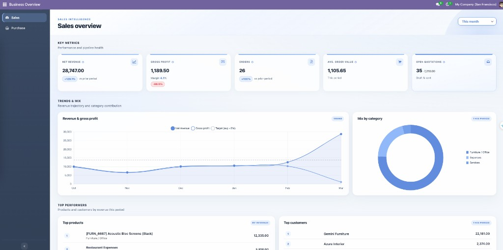

Business Overview Dashboard
===========================

Native **Odoo 19** client application delivering **Sales**, **Purchase**, and **Inventory** executive overviews: KPIs, period analysis, trend and mix charts, ranked lists, and an in-app navigation shell built with **OWL** and **Chart.js**.

Capabilities
------------

- **Unified shell**: Single client action hosts a collapsible sidebar; switching views updates only the dashboard body (no full client-action reload).
- **Sales overview**: Net revenue, gross profit (standard-price–based cost), orders, average order value, open quotations; trends, mix, and top rankings.
- **Purchase overview**: Confirmed PO spend, PO count, average PO value, active vendors, open RFQs; trends, mix, and top rankings.
- **Inventory overview**: On hand, reserved, available, approximate on-hand value; open transfers; low stock rules; dead stock; inbound vs outbound trend; category/value mix and top products.
- **Period selection**: Preset periods plus **custom date range** (inclusive; max span enforced). Custom range disables prior-period comparisons.

Requirements
------------

- **Odoo**: 19.0
- **Dependencies**: base, web, sale_management, purchase, stock
- **Python**: uses ``dateutil`` (standard in Odoo)

Optional SQL scripts under ``scripts/`` are for development only. Use them on non-production databases with a backup.

Installation
------------

1. Add the module to your addons path (e.g. ``custom_modules_19/odoo_overview_dashboard``).
2. Update the app list and install **Business Overview Dashboard**, or upgrade:

   ::

      ./odoo-bin -u odoo_overview_dashboard -d YOUR_DATABASE

3. After changing static assets, restart Odoo or regenerate assets bundles in developer mode.

Usage
-----

Menus
~~~~~

- **Business Overview → Sales**
- **Business Overview → Purchase**
- **Business Overview → Inventory**

Access is controlled by standard groups:

- Sales: ``sales_team.group_sale_salesman``
- Purchase: ``purchase.group_purchase_user``
- Inventory: ``stock.group_stock_user``

HTTP API (JSON-RPC)
-------------------

Authenticated routes:

- ``POST`` ``/odoo_overview_dashboard/sales/data``
- ``POST`` ``/odoo_overview_dashboard/purchase/data``
- ``POST`` ``/odoo_overview_dashboard/inventory/data``

Parameters:

- ``period``: ``month``, ``quarter``, ``year``, ``week``, ``last_month``, ``last_quarter``, ``last_year``, ``last_7_days``, ``last_30_days``, ``custom``
- For ``custom``: ``date_from`` and ``date_to`` in ``YYYY-MM-DD`` (inclusive range)

Example::

  {"period": "quarter"}

Custom range example::

  {"period": "custom", "date_from": "2025-01-01", "date_to": "2025-03-31"}

Technical structure
-------------------

- Client shell & dashboards: ``static/src/js/overview/`` and ``static/src/xml/``
- Styling: ``static/src/scss/sales_overview.scss``
- Period logic: ``models/overview_period.py``
- Services: ``models/sales_overview.py``, ``models/purchase_overview.py``, ``models/inventory_overview.py``
- Routes: ``controllers/*_overview_controller.py``
- Menus & actions: ``views/menu.xml`` and ``views/*_overview_action.xml``

License
-------

LGPL-3

